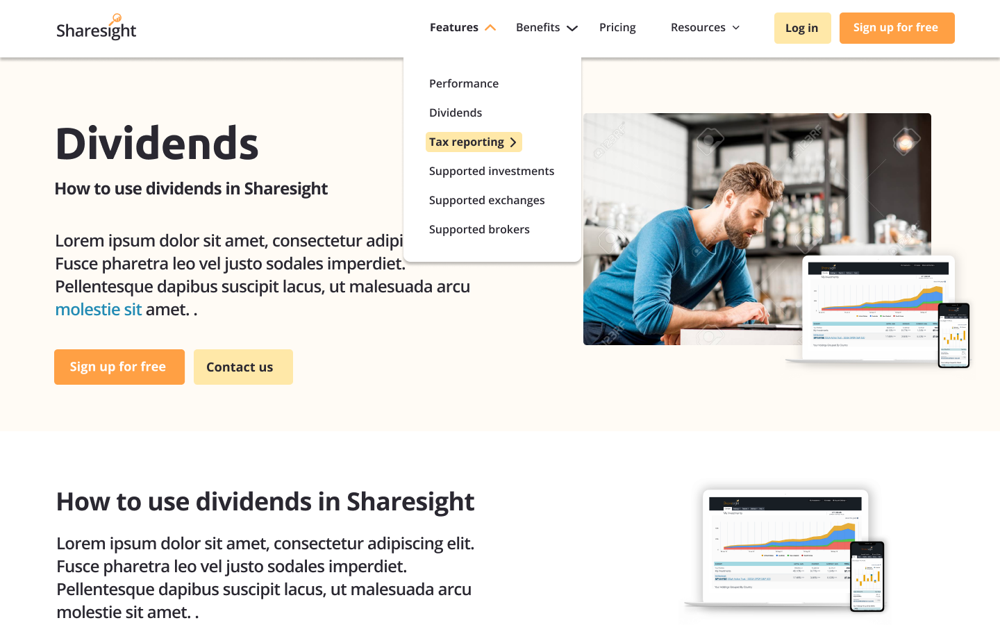

# static-interview-prompt

A quick interview prompt for our Static React Developer hire.

---

We're currently working on a new redesign for our [marketing site](https://www.sharesight.com) and as a part of the interview process, we'd like you to roughly implement this mockup however you see fit.

🎉 React or Gatsby would be ideal, but the most important thing is to pick what you're comfortable with.

---

## Instructions:
1. Roughly implement the **header** portion of this [mockup](#the-mockup).
   - A logo is provided in this repo.
   - Ignore the hero image and content below, just focus on the header.
   - Feel free to use any placeholders if it makes you more comfortable.
2. Deliverable is up to you: email a Github repo, Google Drive, a Zip File, or even a Link with instructions on how to run it.
3. Any questions or next steps you have are good to have written down.

### Time Guidance
1. ⏲️ Try to spend an hour or less on the implementation and take shortcuts to get there.  Your approach and structure are worth as much as the implementation.
2. Structure your time as you see fit.  We don't expect an aria-compliant dropdown to happen; just discuss what you'd do next on things you decided to cut.
3. A wireframe followed by filling in roughly is where we'd start.

## Be Comfortable:
1. Highly recommend using a boilerplate or starter.
   - eg. Gatsby: https://www.gatsbyjs.com/docs/starters/
   - Any starter or ecosystem is fine.  If React is outside of your comfort zone, HTML + CSS is perfectly fine.
2. Use any package, boilerplate, or framework.  Bootstrap, Tailwind, MaterialUI, etc are suggested.
   - Don't worry about a full Typescript + Gatsby + Styled-Components if that's not your comfort zone.
   - We'd rather see what you're comfortable at today and we'll teach you the rest.
3. This is not a pixel perfect challenge.  We'd rather see why and where you used a certain layout over the spacing of that layout.

---

## The Mockup:

This mockup is super fresh–a WIP–probably already outdated.  But this is what you'll be getting into with this position.

